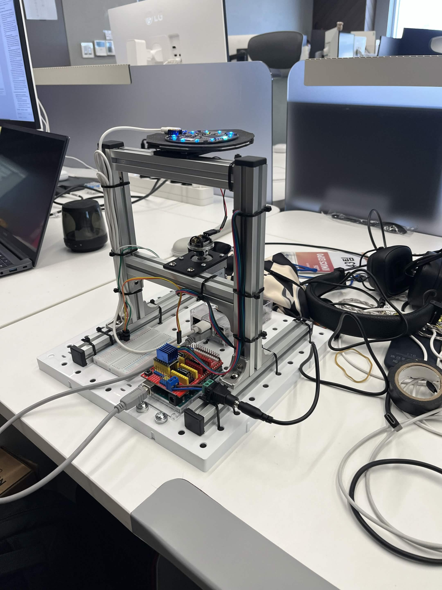

# Sound Tracking System with Arduino

Version: v1.0

A Raspberry Pi and Arduino based sound-tracking turret prototype. The system uses a microphone array to estimate the direction of incoming sound, then sends the target angle to an Arduino-controlled motor stage.



## Overview

This repository contains the PC-side and Raspberry Pi-side Python scripts used to test and run a sound-direction tracking prototype.

The project is organized around three development stages:

1. TCP communication tests between a PC and Raspberry Pi.
2. Microphone recording and audio transfer tests.
3. Sound direction estimation and Arduino motor control.

The latest v1.0 Raspberry Pi scripts support both SRP-PHAT based software direction estimation and ReSpeaker/XMOS hardware direction data.

## Hardware

Bill of materials for the v1.0 prototype:

| Part | Quantity |
| --- | --- |
| NEMA17 stepper motor | 1 |
| NEMA17 straight bracket | 2 |
| TMC2209 stepper driver | 1 |
| Arduino CNC Shield | 1 |
| Arduino Uno R3 | 1 |
| 2020 aluminum extrusion, 250 mm | 4 |
| 2020 aluminum extrusion, 200 mm | 2 |
| Seeed Studio XVF3800 4-mic array | 1 |
| 400-hole breadboard | 1 |
| Raspberry Pi 3B+ | 1 |
| Laser module | 1 |

A PC or laptop is also used for test control, TCP communication checks, and audio receiving.

## Repository Structure

```text
.
+-- assets/
|   +-- hardware.jpg
+-- pc/
|   +-- 01_socket_test.py
|   +-- 02_mic_tcp_test.py
|   +-- 03_test_arduino.py
+-- rpi/
    +-- 01_socket_test.py
    +-- 02_mic_tcp_test.py
    +-- 03_test_arduino.py
    +-- 04_rpi_srp_phat_test.py
    +-- 05_srp_arduino.py
    +-- 06_mic_test.py
    +-- 07_srp_arduino_v2.py
```

## PC Scripts

| File | Purpose |
| --- | --- |
| `pc/01_socket_test.py` | Starts a TCP server and receives a test message from the Raspberry Pi. |
| `pc/02_mic_tcp_test.py` | Receives raw audio from the Raspberry Pi and saves it as `test_record.wav`. |
| `pc/03_test_arduino.py` | Sends manual angle commands to the Raspberry Pi over TCP. |

## Raspberry Pi Scripts

| File | Purpose |
| --- | --- |
| `rpi/01_socket_test.py` | Connects to the PC TCP server and sends a test message. |
| `rpi/02_mic_tcp_test.py` | Records 3 seconds of microphone audio and sends it to the PC. |
| `rpi/03_test_arduino.py` | Receives angle commands from the PC and forwards them to Arduino over serial. |
| `rpi/04_rpi_srp_phat_test.py` | Runs SRP-PHAT direction estimation with a 4-channel microphone stream and a 4-second audio buffer. |
| `rpi/05_srp_arduino.py` | Uses ReSpeaker/XMOS hardware VAD and DOA data, then sends the detected angle to Arduino. |
| `rpi/06_mic_test.py` | Lists connected microphone/input devices and their supported channel counts. |
| `rpi/07_srp_arduino_v2.py` | Final SRP-PHAT turret test using 6-channel audio input, calibrated microphone mapping, motor cooldown, angle clipping, and polarity inversion compensation. |

## Requirements

Python packages used by the scripts:

```bash
pip install numpy pyserial pyaudio pyusb pyroomacoustics
```

Depending on your operating system, `pyaudio` may require PortAudio development headers before installation.

## Configuration

Before running the scripts, update the hard-coded IP addresses for your network:

- `rpi/01_socket_test.py`: `PC_IP`
- `rpi/02_mic_tcp_test.py`: `PC_IP`
- `pc/03_test_arduino.py`: `RPI_IP`

Default ports:

- `5005`: PC receive/test server
- `5006`: Raspberry Pi command server for Arduino control

## Usage

### 1. Test TCP Communication

On the PC:

```bash
python pc/01_socket_test.py
```

On the Raspberry Pi:

```bash
python rpi/01_socket_test.py
```

### 2. Test Microphone Audio Transfer

On the PC:

```bash
python pc/02_mic_tcp_test.py
```

On the Raspberry Pi:

```bash
python rpi/02_mic_tcp_test.py
```

The PC saves the received audio as `test_record.wav`.

### 3. Test Manual Arduino Angle Control

On the Raspberry Pi:

```bash
python rpi/03_test_arduino.py
```

On the PC:

```bash
python pc/03_test_arduino.py
```

Enter an angle such as `45` or `-90` on the PC. The Raspberry Pi forwards the command to the Arduino over serial.

### 4. Scan Microphone Devices

On the Raspberry Pi:

```bash
python rpi/06_mic_test.py
```

Use this to confirm the input device and channel count before running the SRP-PHAT scripts.

### 5. Run Sound Tracking

For ReSpeaker/XMOS hardware-assisted tracking:

```bash
python rpi/05_srp_arduino.py
```

For the calibrated SRP-PHAT turret test:

```bash
python rpi/07_srp_arduino_v2.py
```

## Notes

- The scripts are experimental prototypes and use fixed IP addresses, ports, device assumptions, and calibration values.
- Arduino serial auto-detection checks for common `Arduino`, `ACM`, and `USB` device names.
- `rpi/07_srp_arduino_v2.py` assumes a 6-channel input stream and extracts microphone channels `Ch1-Ch4` from `audio_float[1:5]`.
- Angle commands are sent to Arduino as newline-terminated UTF-8 text.

## Version

v1.0 includes the complete PC/Raspberry Pi test scripts, SRP-PHAT direction estimation experiments, ReSpeaker/XMOS hardware DOA integration, and Arduino serial motor command flow.
